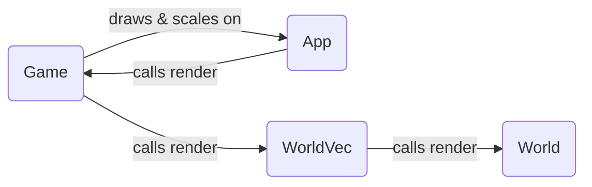

# yumenet-entt
YumeNet client written with EnTT. This project uses:

- Raylib 5.0
- EnTT 3.12.2

```mermaid
graph LR;
    g(Game);
    a(App);
    wv(WorldVec);
    w(World);

    a -->|calls render| g -->|calls render| wv -->|calls render| w;
    g -->|draws & scales on| a;
```
