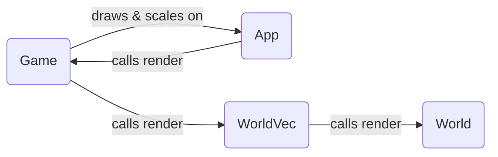

# yumenet-client
YumeNet client. This project uses:

- Raylib (5.0)
- EnTT (3.12.2)
- ini-cpp latest

> [!NOTE]
> `yumenet-client` has most of its dependencies added as subdirectories. To clone the repo including those, run:
> 
> ```
> $ git clone https://github.com/verdiur/yumenet-client --recursive
> ```


